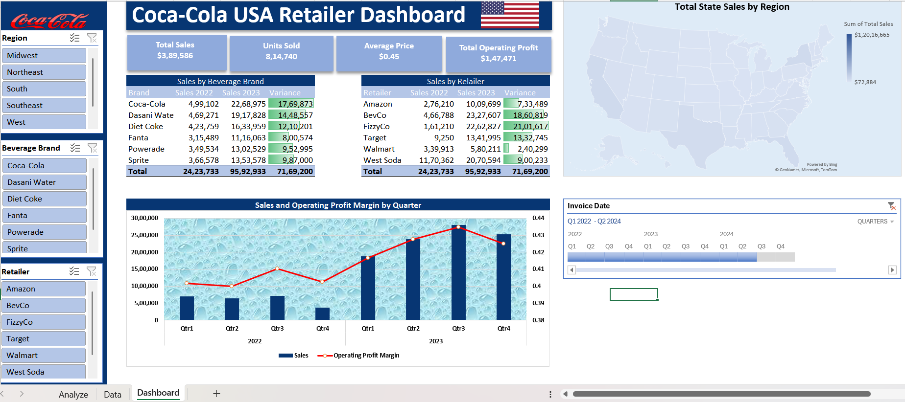
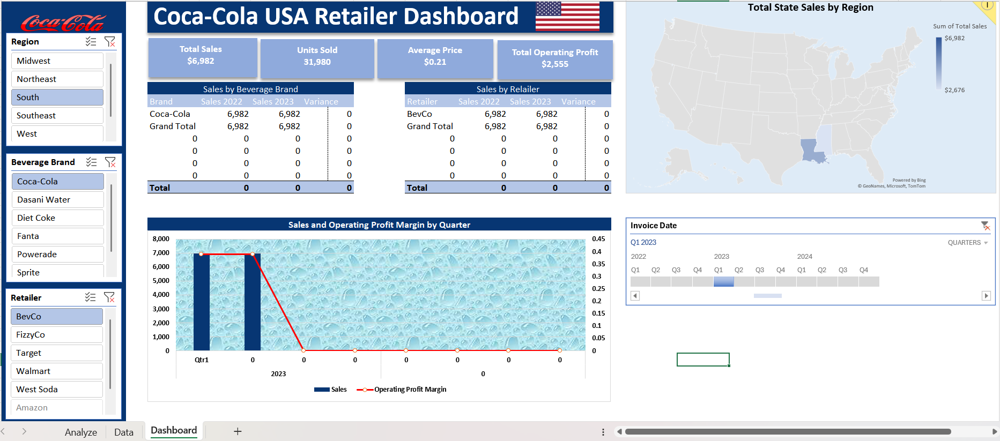
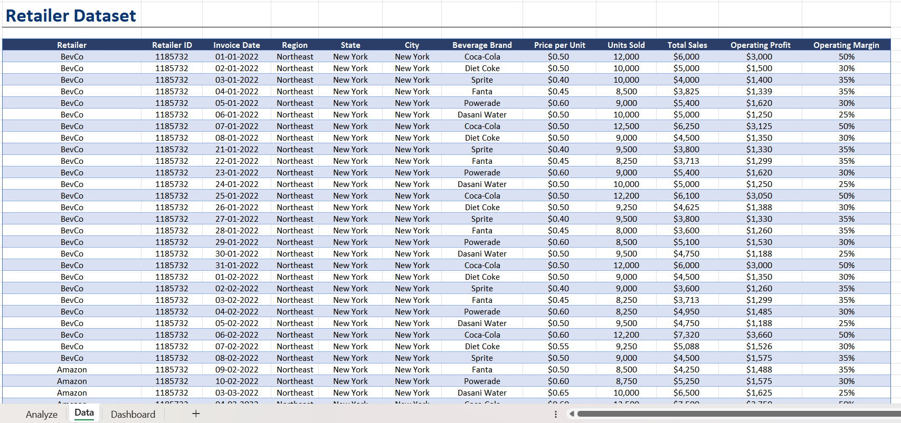

# Coca-Cola-USA-Retailer-Dashboard

This Excel dashboard provides insights into Coca-Cola's sales performance, operating profit margins, and regional trends. It helps retailers and stakeholders make data-driven decisions to optimize sales strategy and performance.

---

## 📊 Dashboard Overview

---

## 🎚️ Dynamic Slicers

Interactive slicers allow users to filter by product category, region, quarter, and retailer for tailored insights.

---

## 🚀 Features

- **Sales by Beverage Brand**  
  Table showing performance for Coca-Cola product lines with year-over-year variance.

- **Sales by Retailer**  
  Highlights total sales and growth across major retailers such as Amazon, Walmart, and Target.

- **Regional Sales Distribution**  
  Map visualizing total sales by U.S. regions for geographic performance comparison.

- **Sales and Profit Margins by Quarter**  
  Combined line and bar chart showing quarterly sales and operating profit trends.

---

## 🛠️ Tools Used

- **Excel**: For interactive dashboard creation and data visualization  
- **Data Processing**: Cleaned and transformed raw data to ensure accurate insights

---

## 💡 Key Insights

- Dasani Water and FizzyCo saw the highest year-over-year growth among Coca-Cola products and retailers.
- Midwest and Southeast regions reported the highest sales figures.
- Q3 consistently delivers strong sales and profit margins — an opportunity for focused seasonal marketing.

---
